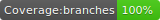

# Resume Builder

  
&nbsp;&nbsp;&nbsp;

This project is my personal resume, however it can be cloned and customised to make your own!

Check out [stevemckinnon.co.uk](http://stevemckinnon.co.uk) for a demo. 

## Installation

To install the dependencies type `npm install` in your terminal.

Then type `npm start` to start the server. This runs the app in the development mode. 
Open [http://localhost:3000](http://localhost:3000) to view it in the browser.

The page will reload if you make edits. 
You will also see any lint errors in the console.

## Customisation

To customise the project for your own, add your personal details, education, jobs, and skills via creating a GraphQL schema using [GraphCMS](https://graphcms.com). Follow the tutorial [here](https://docs.graphcms.com) to get started with creating your schema.

## Support

For support issues, please raise them [here](https://github.com/stevenmckinnon/resume/issues).

